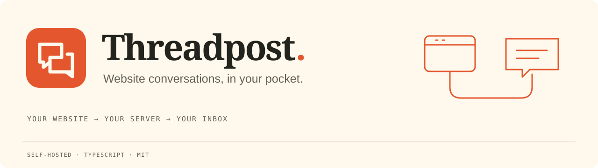
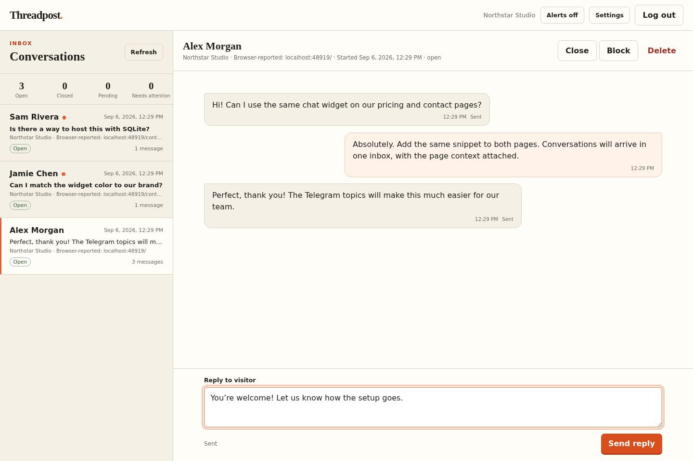
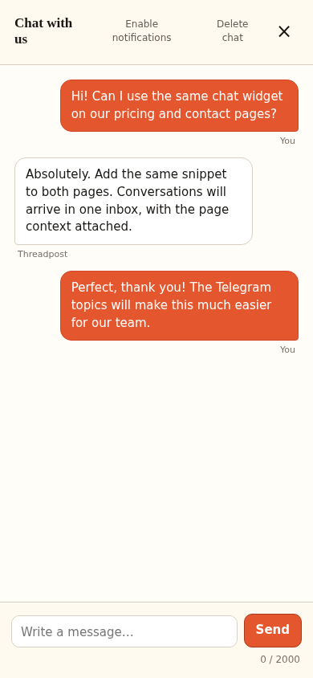
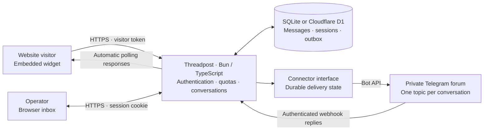

<p align="center"></p>

# Threadpost

[](https://github.com/s04/threadpost/actions/workflows/check.yml)
[](LICENSE)
[](package.json)
[](.github/workflows/check.yml)

Threadpost is a small, self-hosted inbox for conversations started from a website widget. Visitors write from the embedded widget; operators reply from the local admin interface or, when configured, a private Telegram forum.

Threadpost is an open-source starter for one workspace and one running process. It is not a hosted multi-tenant service.

**Public alpha:** see the [readiness review and next priorities](docs/release-readiness.md)
and [security review](docs/security-review.md) for what is included, what was
tested, and the remaining limitations.

- **One script to embed.** Customize the title, greeting, color, and position.
- **Reply where you are.** Use the browser inbox or a private Telegram forum, with one topic per conversation.
- **Messaging basics included.** Automatic updates, unread indicators, opt-in browser notifications, blocking, and deletion.
- **Your infrastructure.** Bun and SQLite locally; a Cloudflare Worker, Container, and D1 when hosted.
- **A small TypeScript library.** Reuse the bridge and storage interfaces, or implement your own connector. Telegram ships today; WhatsApp and Matrix adapters are not included.

## A look inside



<p align="center"></p>

Screenshots use fictional names and local demo messages. No customer data or live provider connection is shown.

## How it fits together



Provider secrets stay on the server. On Cloudflare, the Worker serves browser
assets and applies edge limits, then routes requests through one Durable Object
to the Bun container. D1 persists data through container sleep and restarts.
Local deployments run Bun directly with SQLite. Browser notifications need an
open page; they are not push notifications for a closed browser.

**Checks:** `bun run check` runs type checking, tests, and browser builds locally.
The badge links to the latest manually dispatched GitHub check; pushes do not
start hosted CI.

## Requirements

- [Bun 1.3.10](https://bun.sh/)
- A writable directory for the SQLite database

## Run locally

```sh
cp .env.example .env
```

Set `ADMIN_TOKEN` in `.env` to a unique value of at least 32 characters. Then install dependencies and start the server:

```sh
bun install --frozen-lockfile
bun run start
```

Open `http://localhost:8788` for the demo page or `http://localhost:8788/admin` for the admin inbox. Run the project checks with:

```sh
bun run check
```

The application uses Bun's native SQLite driver. By default, durable state is stored in `data/threadpost.sqlite`.

Use **Settings → Telegram** to connect a demo workspace while preserving its
history. When changing environment-based connector identity, the site ID, or
the destination bot/group, use a fresh `DB_PATH`. Each database is bound to its
workspace so old conversation threads cannot be routed to a different inbox.

## Embed the widget

Add this script to a page whose exact origin is listed in `ALLOWED_ORIGINS`:

```html
<script src="https://support.example.com/widget.js" data-site="demo" data-title="Chat with us" data-greeting="How can we help?" data-color="#e4572e" data-position="right" defer></script>
```

Only `data-site` is required. `data-title` sets the launcher and panel title (default: `Chat with us`), `data-greeting` sets the empty-conversation introduction (default: `Send a message and we’ll reply here.`), `data-color` sets the accent when given as an exact six-digit hex color such as `#e4572e`, and `data-position` places the desktop launcher and panel on the `left` or `right` (default: `right`). The mobile panel remains full width. Invalid color and position values fall back to the defaults, and the widget chooses black or white accent text for contrast.

The widget derives the API address from the script URL. Conversation credentials stay in browser storage scoped to the server and site, and are sent only in authorization headers. Custom text is inserted as plain text; the widget does not accept HTML or CSS through these options.

## Configuration

| Variable | Default | Purpose |
| --- | --- | --- |
| `HOST` | `127.0.0.1` | Address the Bun server listens on. Use `0.0.0.0` inside a container. |
| `PORT` | `8788` | HTTP port. |
| `PUBLIC_URL` | `http://localhost:8788` in development | Public base URL used for links, embeds, and the Telegram webhook. |
| `ADMIN_TOKEN` | required | Admin sign-in secret, at least 32 characters. |
| `DB_PATH` | `data/threadpost.sqlite` | SQLite database path. |
| `SITE_ID` | `demo` | Site identifier used by the widget. |
| `SITE_NAME` | `Demo site` | Human-readable site name. |
| `ALLOWED_ORIGINS` | includes `PUBLIC_URL` | Comma-separated exact origins allowed to call the API. Include every page origin that embeds the widget. |
| `CONNECTOR` | `demo` | Connector to use: `demo` or `telegram`. |
| `TELEGRAM_BOT_TOKEN` | empty | Bot token required by the Telegram connector. |
| `TELEGRAM_CHAT_ID` | empty | Negative numeric ID of the private forum supergroup. |
| `TELEGRAM_OPERATOR_IDS` | empty | Comma-separated Telegram user IDs allowed to operate the bot. |
| `TELEGRAM_WEBHOOK_SECRET` | empty | Webhook secret of at least 32 characters, required by the Telegram connector. |

`PUBLIC_URL` must be an origin without a path, query, or fragment. Use exact allowed origins such as `https://www.example.com`, without paths or wildcards. Threadpost always adds `PUBLIC_URL` to the allowed list. Both `PUBLIC_URL` and every embedding origin must use HTTPS; plain HTTP is accepted only for `localhost`, `127.0.0.1`, and `[::1]` during local development.

## Docker Compose

Copy `.env.example` to `.env`, set `ADMIN_TOKEN`, then run:

```sh
docker compose up --build -d
```

Compose publishes the service only on `127.0.0.1:8788` and stores SQLite data in the `threadpost-data` volume. Put a TLS-terminating reverse proxy in front of it for public use. To bind a different host port, set `THREADPOST_PORT` before starting Compose.

Back up the volume regularly. For a consistent backup, stop the container before copying the SQLite database.

## Cloudflare Containers and D1

The optional Cloudflare adapter runs the Bun server in a Container and stores
conversation data in D1. Install the existing development dependencies, then
keep the deployment-specific Wrangler configuration outside version control:

```sh
mkdir -p .deploy
cp cloudflare/wrangler.example.jsonc .deploy/wrangler.jsonc
```

In `.deploy/wrangler.jsonc`, change `main` to
`../cloudflare/worker.ts`. Keep the existing `../Dockerfile` image and
`../public` assets paths, replace the D1 database ID, and set `PUBLIC_URL`,
`SITE_ID`, `SITE_NAME`, and the exact `ALLOWED_ORIGINS` for your deployment.
Use your Worker URL as `PUBLIC_URL`, or configure a Worker custom domain and
use that origin. The checked-in example contains placeholders only. The alternative
`cloudflare/wrangler.jsonc` location is also ignored, but `.deploy` keeps all
local deployment material together.

Create the database, generate the reusable schema, and apply it:

```sh
bunx wrangler d1 create threadpost
bun -e 'import { schemaStatements } from "./src/schema.ts"; console.log(schemaStatements.map(sql => sql + ";").join("\n"))' > .deploy/schema.sql
bunx wrangler d1 execute threadpost --remote --file .deploy/schema.sql --config .deploy/wrangler.jsonc
```

Copy the database ID returned by the create command into the ignored config.
Set separate random values of at least 32 characters for the private admin and
container transport secrets. Use `wrangler secret put` for each value, or
`wrangler secret bulk` with a private ignored input file:

```sh
bunx wrangler secret put ADMIN_TOKEN --config .deploy/wrangler.jsonc
bunx wrangler secret put INTERNAL_TOKEN --config .deploy/wrangler.jsonc
bun run build
bunx wrangler deploy --config .deploy/wrangler.jsonc
```

The example limits the deployment to one Container instance. Its Durable
Object serializes requests for the workspace, while D1 keeps conversations and
messages when the Container sleeps. The Container sleeps after two idle
minutes, so the next request can incur a cold start. Admin sessions persist in
D1 and survive restarts, deployments, and container sleep.

The adapter starts with the `demo` connector. Open **Settings → Telegram** in
the admin panel to connect a bot and private forum group. The form verifies the
bot and its topic-management permission, then registers the webhook. Existing
demo history stays in the inbox; only new messages are forwarded after connecting.
Bot settings are encrypted in D1 using a key derived from `INTERNAL_TOKEN`.
Keep that secret stable and backed up; changing it requires recovering the old
key to read the saved settings. Local installations use `SETTINGS_KEY`, falling
back to `ADMIN_TOKEN`. The Worker owns the D1 binding and exposes an authenticated
database transport to the Container; account API credentials stay outside it.

## Telegram connector

Telegram setup is an explicit operator action. Follow the [complete Telegram setup guide](docs/telegram-setup.md) for BotFather, forum permissions, device-specific chat ID steps, operator ID discovery, connection feedback, and an end-to-end test.

The admin panel's **Settings → Telegram** form can perform setup without
changing container configuration. Provide the bot token, group ID, and allowed
operator IDs. The token is never returned to the browser after saving. A bot
already registered at another webhook is rejected; an established inbox cannot
be moved to a different bot/group through this form.

Alternatively, configure the connector through environment variables:

1. Create a bot with BotFather and keep its token private.
2. Create a private supergroup and enable Topics. Open **Group info → Edit / Manage Group → Administrators → Add Administrator**, search for the exact bot username shown by BotFather, select it, enable **Manage Topics**, and save. Menu names vary between mobile, desktop, and web.
3. Set `CONNECTOR=telegram`, `TELEGRAM_BOT_TOKEN`, `TELEGRAM_CHAT_ID`, `TELEGRAM_OPERATOR_IDS`, and a unique `TELEGRAM_WEBHOOK_SECRET` of at least 32 characters.
4. Set `PUBLIC_URL` to the public HTTPS origin that reaches Threadpost.
5. Run `bun run src/setup-telegram.ts` once to verify the configuration and register `${PUBLIC_URL}/webhooks/telegram`.

The webhook route authenticates Telegram requests with its secret header. Application startup does not register or change the webhook. Telegram operator IDs are numeric IDs, not usernames.

If setup reports **“Telegram could not access that group”** or Telegram returns
**“chat not found”**, check the chat ID and add the same bot whose token you
entered to that group using the administrator steps above. Creating a bot in
BotFather or messaging it privately does not add it to a group. Save its
permissions, then retry **Connect Telegram**.

Messages from the website appear in one forum topic per conversation. Replies sent in Telegram are relayed to the web visitor. Replies sent from the Threadpost admin are stored and delivered directly to the visitor; they are not echoed into Telegram.

## Delivery and privacy limits

Threadpost stores text messages and uses a durable outbox. A send can end with an `unknown` delivery state if the remote service accepted it but the local process could not record the result. Manual retry is available, but retrying an unknown send may create a duplicate.

Bot conversations in Telegram are not end-to-end encrypted. Deleting a conversation in Threadpost deletes only the local records; it does not delete copies already sent to Telegram.

The connector boundary is intended to support more transports later. Matrix and WhatsApp connectors are not implemented.

## Reuse the bridge

All authored application code, including the admin panel and embedded widget,
is TypeScript. `bun run build` bundles browser sources from `src/browser/` into
ignored JavaScript files in `public/`. Start builds them automatically; rebuild
after browser-source edits during development. HTML and CSS remain plain files.

`src/library.ts` exports the store, bridge, HTTP handler and connector contract
for other Bun applications. A connector implements `createThread(conversationId)`
and `send(threadId, body)`. Keep provider credentials server-side; a new transport
also needs an authenticated inbound handler that resolves its thread to exactly
one conversation. The Telegram adapter is the reference implementation.

Package entry points are `threadpost` (Bun server library) and
`threadpost/connectors` (transport contract and adapters). The package has not
been published to npm; use a local path dependency to develop against
it. The bundled SQLite store requires Bun. The connector contract itself does
not depend on Bun.

```ts
import { Bridge, Store } from "threadpost";
import type { Connector } from "threadpost/connectors";

async function connect(adapter: Connector) {
  const store = new Store("data/custom-inbox.sqlite");
  await store.bindWorkspace(`my-app:${adapter.kind}`);
  const bridge = new Bridge(store, adapter);
  // Schedule bridge.flush() in the host service to drain the durable outbox.
  return bridge;
}
```

An inbound adapter calls `await bridge.receive({ eventId, threadId, body })` **after**
validating its provider signature, destination workspace and operator identity.
The bridge deduplicates provider events and routes the reply to the stored
conversation. An unknown external-send outcome must throw `DeliveryError(true)`;
an explicit rejection can throw `DeliveryError(false)`. Never put provider
tokens in the browser. WhatsApp requires its own adapter and platform-policy
handling; it is not enabled by changing the connector name.

The panel supports Telegram connection setup and a widget snippet customizer.
One deployment is one workspace. Multiple
allowed origins share that workspace and are not tenant isolation. A future
multi-app edition needs app-scoped conversations, credentials, routing and
operator permissions before a shared deployment can safely host separate apps.

This starter supports text only and lists the latest 200 conversations in the
panel. Visitor credentials expire after 30 days; stored conversations are not
automatically deleted. Operator sessions expire eight hours after sign-in by default.
Selecting **Keep me signed in for 30 days** extends that login to 30 days. Both
options survive server restarts; use the longer duration only on trusted devices. The browser
stores an HttpOnly, SameSite=Strict cookie (Secure over HTTPS); only a token hash
is persisted in SQLite or D1. Logout revokes that session immediately. Rotating
the admin token invalidates all existing sessions. Background polling does not
extend the selected expiration. Existing sessions retain the expiry set when they were created.

Existing D1 installations must apply `cloudflare/migrations/0003-admin-sessions.sql`
before deploying persistent sessions. The migration is safe to rerun. Local
SQLite creates the session table automatically.
Persistent quotas allow five new conversations per IP per minute, 20 per IP per
day, 30 messages per conversation per minute, and 120 messages per IP per minute.
Workspace daily defaults are 200 new conversations and 5,000 messages; configure
them with `MAX_NEW_CONVERSATIONS_PER_DAY` and `MAX_MESSAGES_PER_DAY`. Shared IPs
share quotas. Cloudflare supplies the trusted client IP; arbitrary forwarded
headers are not trusted. The Worker also limits requests before container
startup (240 requests per IP, five starts per IP, and 1,200 workspace requests
per minute, per Cloudflare location).

## Messaging behavior and protection

The widget and inbox update automatically, normally every three seconds while
active. Background polling uses a 15-second interval, pauses offline, and backs
off after failures. Browsers may throttle background tabs. Both interfaces offer
opt-in browser notifications with generic text; a page must remain open. This
does not implement Web Push for a closed browser. Unread indicators, preserved
drafts and reading position, and stable client message IDs prevent polling or
double-clicks from creating duplicate messages.

Widget title, greeting, accent color and position belong in the generated
snippet. Workspace identity and conversation access belong on the server. The
opaque visitor token grants access to its stored conversation; it does not carry
editable identity claims. The server records the allowed request origin and an
optional matching page path at creation, excluding query strings and fragments.
The inbox labels this as browser-reported context, not verified visitor identity.
Older conversations may have no recorded source.
New Telegram topics include the configured site and a shortened, explicitly
reported page path. Existing topics keep their previous names.

For public deployments, configure both `TURNSTILE_SITE_KEY` and
`TURNSTILE_SECRET_KEY`, and allow the embedding hosts in the Turnstile dashboard.
The server validates the proof, hostname and `start_chat` action before creating
a chat. Existing authenticated conversations do not need another challenge.
Keep the secret server-side. Local development can leave both keys unset.

Operators can block or unblock a conversation. Blocking stops new visitor
messages and holds queued delivery until unblocked; it is not a person-level
ban. Visitors and operators can delete a conversation, invalidating its token
and removing its Threadpost records. Copies already delivered to a messaging
provider remain there. Failed or ambiguous external sends are not automatically
retried.

Existing D1 installations created before these messaging features must apply
`cloudflare/migrations/0002-messaging.sql` before deploying the updated server:

```sh
bunx wrangler d1 execute DB --remote --config path/to/wrangler.jsonc --file cloudflare/migrations/0002-messaging.sql
```

Fresh databases use the current schema and must not run this column-addition
migration again. Local SQLite databases migrate automatically. Choose unique
rate-limit namespace IDs for your account when copying the Worker example.

Every permitted operator's plain-text topic message is a public reply to the
visitor. Slash commands, including `/note`, are ignored. Keep the forum private
and admit operators only: topics do not provide separate membership boundaries.

## Contributing and security

See [CONTRIBUTING.md](CONTRIBUTING.md) for development guidance. Please report vulnerabilities according to [SECURITY.md](SECURITY.md).

## License

Threadpost is available under the [MIT License](LICENSE).
